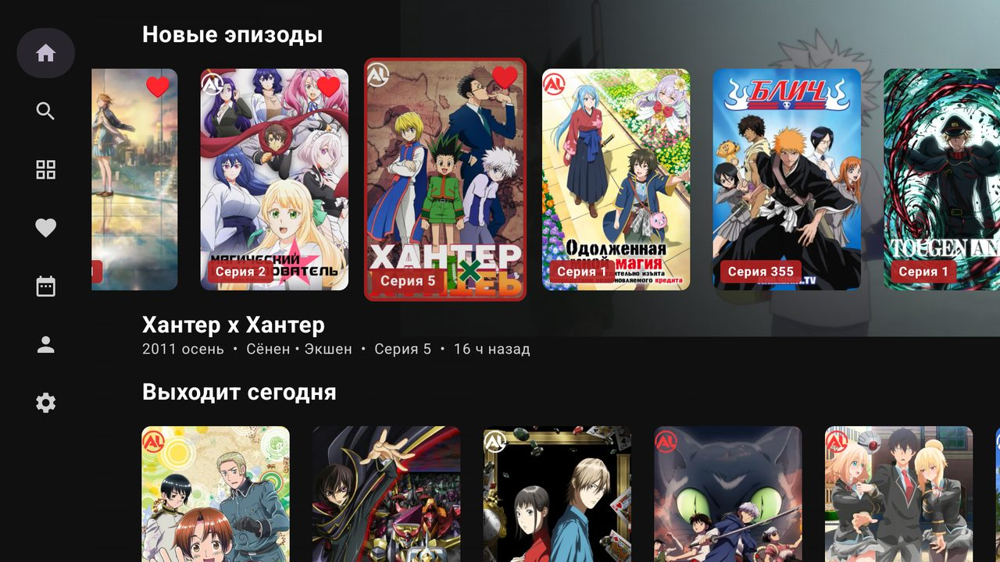
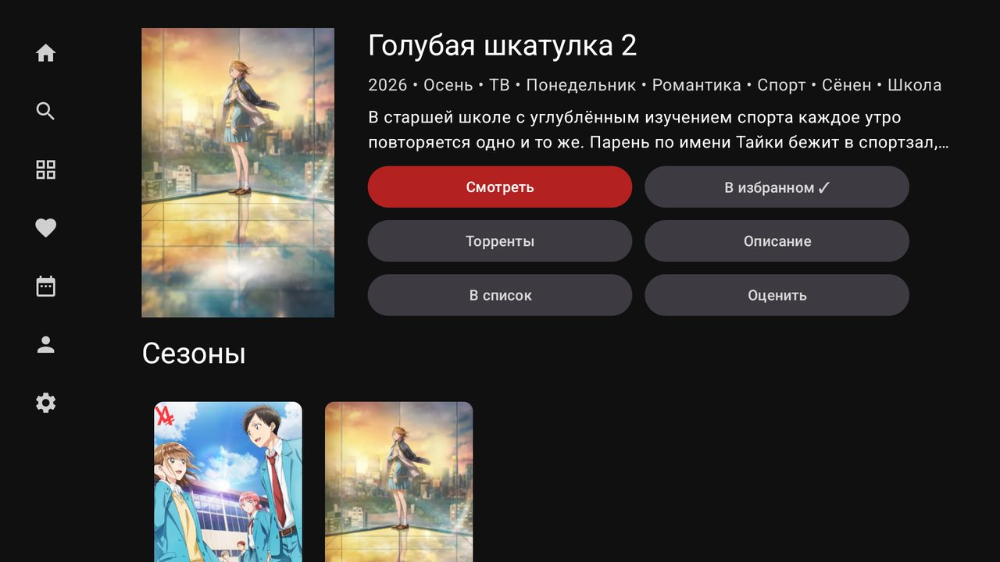
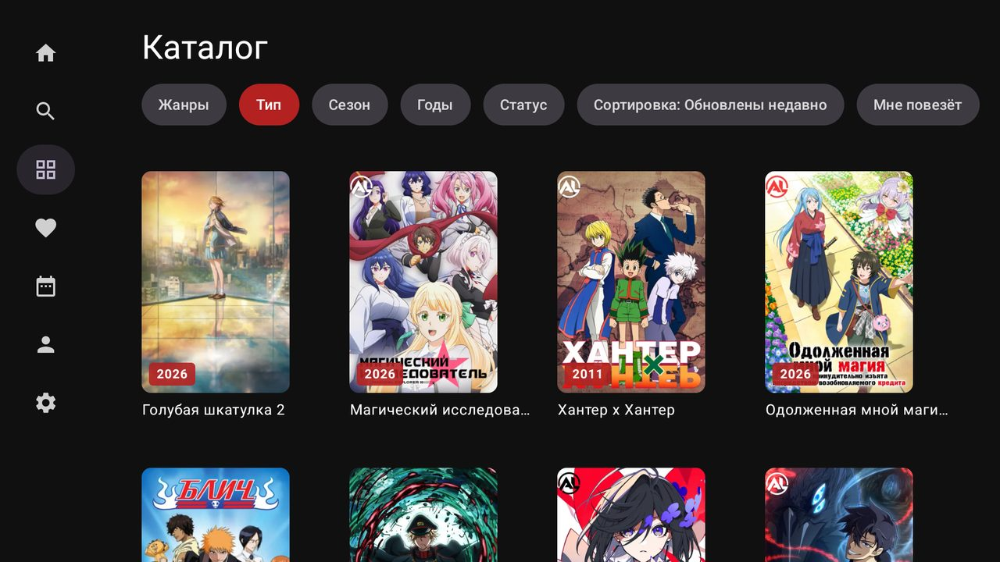
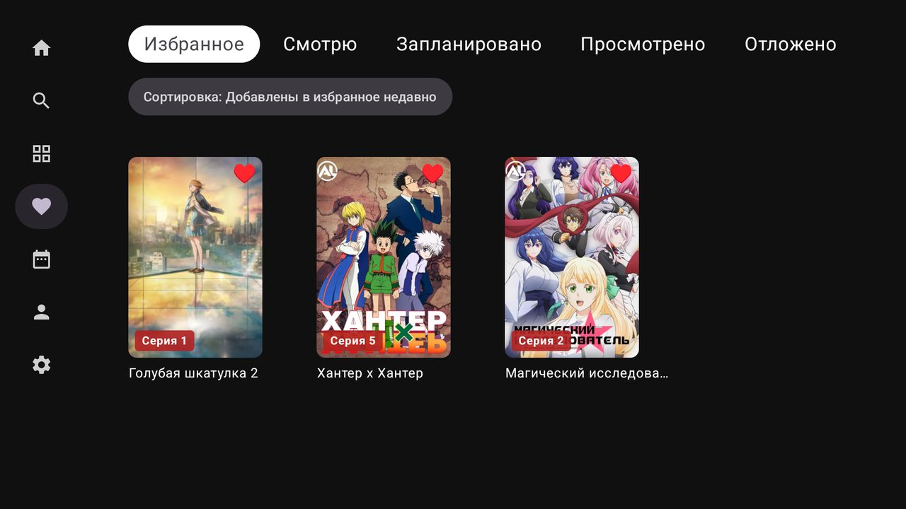
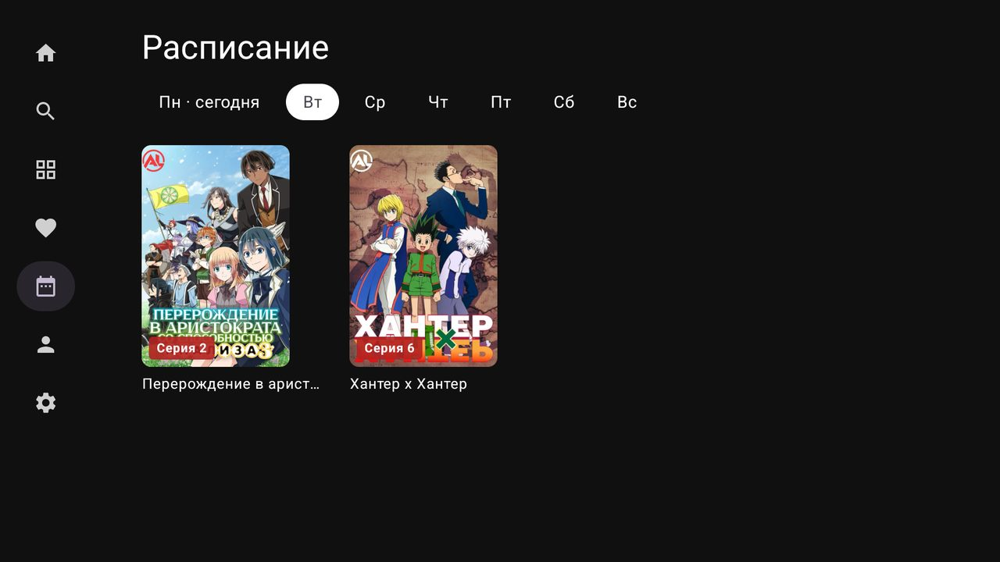

# LibriaTV

**Русский** · [English](README.en.md)

Неофициальный клиент [AniLibria](https://anilibria.top) для Android TV и ТВ-приставок.
Работает на актуальном API v1, поэтому вход в аккаунт работает (в отличие от старого официального
TV-приложения). Интерфейс сделан под пульт: всё управляется стрелками и OK.



> Проект не связан с командой AniLibria. Весь контент принадлежит правообладателям и
> загружается с серверов AniLibria; приложение само ничего не хранит и не раздаёт.

## Возможности

- **Вход в аккаунт** по коду: откройте ссылку или QR на телефоне и введите код с экрана ТВ.
  Можно и по логину с паролем.
- **Главная**: новые эпизоды бесконечной лентой, «Продолжить просмотр», что выходит сегодня
  и завтра, рекомендации. На фоне — постер или живое превью выбранного тайтла.
- **Новые серии в избранном**: сообщение при запуске и отдельный канал на главном экране
  Android TV; недосмотренное попадает в системный ряд «Продолжить просмотр».
- **Избранное и списки**: «Смотрю», «Запланировано», «Просмотрено», «Отложено», «Брошено»;
  своя оценка тайтла.
- **Карточка релиза**: все сезоны франшизы, похожие тайтлы, список серий с превью.
- **Каталог** с фильтрами (жанры, тип, сезон, годы, статус), сортировкой и кнопкой «Мне повезёт».
- **Поиск**, в том числе голосовой.
- **Расписание** выхода серий на неделю.
- **Плеер**: 480/720/1080p, пропуск опенинга и эндинга (кнопкой или автоматически), скорость,
  таймер сна, ночной режим звука, превью при перемотке, автопереход к следующей серии,
  синхронизация частоты кадров с ТВ. Прогресс просмотра синхронизируется с аккаунтом.
- **Торренты через [TorrServe](https://github.com/YouROK/TorrServer)**: если он установлен,
  можно выбрать серию внутри раздачи, и она отметится просмотренной. Без TorrServe раздача
  откроется в любом торрент-приложении или передаётся на телефон QR-кодом.
- **Пульт с телефона**: отсканируйте QR на ТВ, чтобы искать тайтлы и управлять плеером
  с телефона в той же Wi-Fi-сети.
- **Оформление**: тёмная или OLED-чёрная тема, 6 цветов акцента, размер интерфейса 90–130 %.
- **Автообновление** из GitHub Releases. Отчёты о падениях — только с вашего согласия.
- Интерфейс на русском и английском.

| | |
|---|---|
|  |  |
|  |  |

## Установка

1. Скачайте `LibriaTV-*.apk` из [Releases](../../releases/latest).
2. Поставьте на приставку любым удобным способом: флешка и файловый менеджер, Send Files to TV или adb:
   ```
   adb connect <IP-приставки>:5555
   adb install -r LibriaTV-<версия>.apk
   ```
3. Дальше приложение обновляется само: когда выходит новая версия, оно предложит её установить.

Требования: Android 7.0+ (Android TV, Google TV, ТВ-боксы). Сервисы Google не нужны.

## Сборка

JDK 21 и Android SDK (platform 36). Путь к SDK — в `local.properties` (`sdk.dir=...`) или `ANDROID_HOME`.

```
./gradlew :app:assembleDebug :app:testDebugUnitTest
```

APK: `app/build/outputs/apk/debug/app-debug.apk`. Выпуск подписанных версий — в
[docs/RELEASING.md](docs/RELEASING.md).

## Обратная связь

Ошибки и предложения — в [Issues](../../issues).

## Лицензия

[GPL-3.0](LICENSE)
